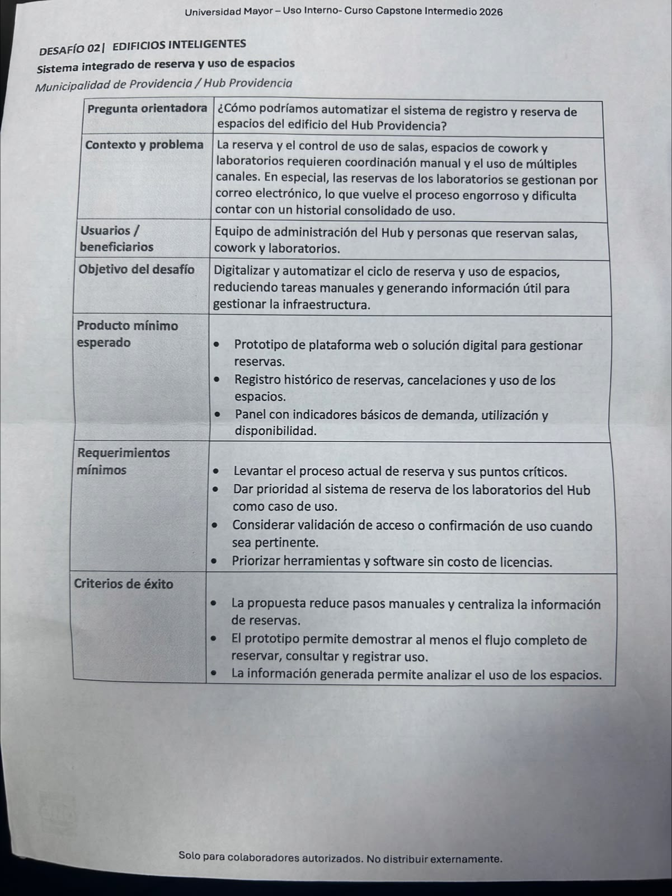
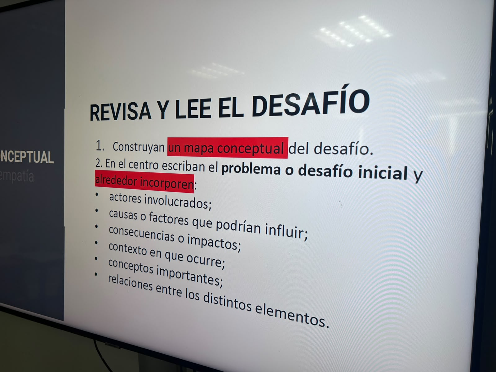
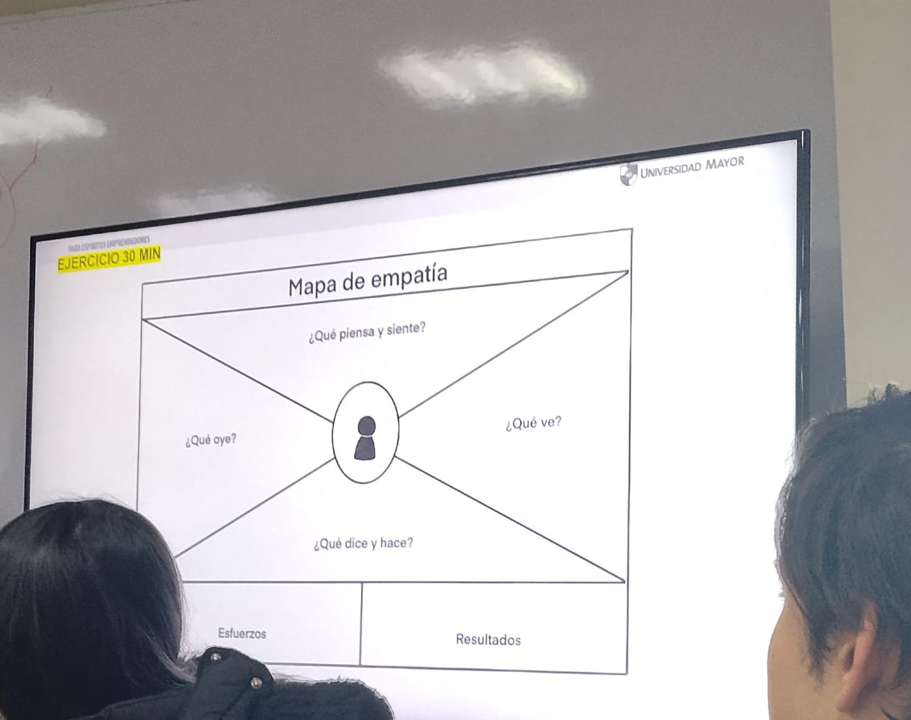

Durante la segunda clase se trabajó principalmente en la comprensión y organización de la información correspondiente al proyecto del Edificio HUB Providencia.
Como primera actividad, la profesora entregó información relacionada con el proyecto, a partir de la cual el equipo debía construir un mapa conceptual. Todos los integrantes analizaron el material, tomaron notas y aportaron ideas para determinar cuáles eran los elementos principales y cómo podían relacionarse.
El mapa se centró en la automatización del registro y sistema de reservas de espacios del Edificio HUB. Durante su elaboración se organizaron aspectos como los conceptos importantes, el contexto, los actores involucrados, las relaciones existentes y las consecuencias del problema.
Entre los conceptos identificados se encontraron la digitalización del sistema, automatización del registro y plataforma de reservas. También se identificó como contexto el Edificio HUB Providencia y su transición hacia un modelo de edificio inteligente.

Respecto de los actores, se reconocieron principalmente la administración y los usuarios. A partir del análisis se relacionó el uso de registros manuales con pérdida de tiempo para la administración y se identificó la necesidad de que los usuarios puedan interactuar adecuadamente con el sistema.

Entre las consecuencias identificadas se registraron demoras o respuestas nulas, problemas en la gestión, fricción con los usuarios, falta de información y pérdida de tiempo.
Una vez finalizado, el mapa conceptual fue pegado en la pared del aula para que la profesora pudiera revisarlo. La profesora observó el trabajo realizado y posteriormente se continuó con las actividades de la clase.
Durante la misma sesión también se realizó un pitch de aproximadamente dos minutos. El tema trabajado por el equipo fue “El arte perdido de contar chistes malos”. El grupo organizó las ideas necesarias para abordar el tema de manera breve y se incorporó un chiste dentro de la exposición, buscando relacionar directamente la presentación con el tema escogido.

Aprendizaje de la sesión: el trabajo permitió organizar visualmente información de un problema, identificar relaciones entre sus diferentes componentes y sintetizar ideas. La actividad del pitch permitió además practicar la comunicación de un tema dentro de un tiempo limitado.

