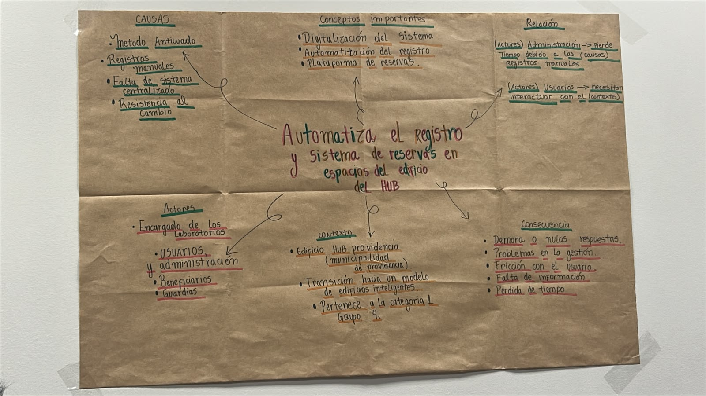

# S02 - Conformación de equipo, definición del desafío y práctica
**Fecha:** 25-08-2026
**Participantes:** 
* Agatha Meza
* Deyanira Muñoz
* Kevin Maicol Stuardo Miranda
* Ruth Gómez
* Felipe Gutiérrez

**Responsable del registro:** Felipe Gutiérrez

---

## 1. Minuta de la 1era Reunión y Contrato de Equipo

* **Nombre del equipo:** SmartSpaces
* **Foto del equipo:** 

### Valores del Equipo
* **Compromiso y Puntualidad:** Cumplir rigurosamente con los plazos de entrega y asistencia a las reuniones, asegurando que todos aporten de manera equitativa al desarrollo del proyecto.
* **Comunicación Transparente:** Mantener un flujo constante de información entre los 5 integrantes, notificando de inmediato cualquier impedimento técnico o de tiempo para apoyarse en equipo.
* **Responsabilidad Compartida:** Asumir un rol activo en las decisiones de diseño y desarrollo, garantizando que el sistema responda eficientemente al problema de los usuarios.

### Normas y Reglas
* **Reuniones de Coordinación:** Se realizará una reunión semanal fija para revisar los avances del repositorio de GitHub y repartir las tareas de la siguiente fase.
* **Gestión de Entregables:** Las actualizaciones de código y documentos en Markdown deben ser revisadas por al menos un compañero antes de consolidarlas en el repositorio.
* **Canal Oficial:** Se utilizará un grupo de comunicación rápida (WhatsApp/Discord) para avisos diarios y GitHub como el único medio oficial para el control de versiones y entregables de la asignatura.

### Definición del Desafío
* Nuestro desafío se enfoca en resolver los problemas de ineficiencia, sobreposición de horarios y falta de trazabilidad en el **registro y reservación de salas** dentro del marco de un Edificio Inteligente. Buscamos diseñar e implementar una solución tecnológica centralizada que automatice la gestión de disponibilidad y optimice el uso de los espacios físicos para los usuarios.

---

## 2. Objetivos SMART

* **Objetivo SMART del Equipo:** 
Desarrollar un prototipo funcional de sistema de reservación de salas inteligente, con interfaz de usuario y registro centralizado en base de datos, para la segunda semana de noviembre de 2026, optimizando la gestión de espacios en el edificio.

* **Declaraciones de Compromiso SMART por Persona:**
    * **Felipe Gutiérrez:** Documentar semanalmente los avances, acuerdos y minutas del equipo en archivos Markdown dentro del repositorio de GitHub, realizando los commits antes de cada clase para asegurar la trazabilidad del proyecto.
    * **Agatha Meza:** Levantar y estructurar los requerimientos de usuario para el flujo de reservación de salas, entregando el mapa de procesos para la tercera semana de septiembre.
    * **Deyanira Muñoz:** Diseñar las maquetas visuales e interfaz de usuario (UI) para el sistema de reserva, finalizando los prototipos interactivos antes de la primera semana de octubre.
    * **Kevin Maicol Stuardo Miranda:** Investigar y definir la arquitectura de base de datos necesaria para almacenar usuarios, salas y horarios disponibles, presentando la propuesta técnica a fines de septiembre.
    * **Ruth Gómez:** Coordinar la validación funcional de las reservas de salas y preparar las pruebas de usuario, verificando el correcto registro de eventos para la primera semana de noviembre.

---

## 3. Comprensión del Proyecto y Práctica de Pitch

1. **Análisis del desafío:** La profesora entregó los antecedentes del proyecto. Todos los integrantes analizamos el material, tomamos notas y aportamos ideas para determinar cuáles eran los elementos principales y cómo podían relacionarse.
2. **Construcción del Mapa Conceptual:** Estructuramos el mapa centrado en la automatización del registro y sistema de reservas de espacios del Edificio HUB. 
   * Identificamos conceptos clave (digitalización, plataforma de reservas), el contexto (transición hacia un edificio inteligente), y las consecuencias actuales (demoras, fricción con usuarios, pérdida de tiempo). 
   * Reconocimos a la administración y a los usuarios como los actores principales, destacando cómo los registros manuales generan ineficiencias.

3. **Revisión docente:** Una vez finalizado, pegamos el mapa conceptual en la pared del aula para que la profesora pudiera observar el trabajo realizado y darnos retroalimentación.
4. **Práctica de Pitch:** Durante el segundo bloque, realizamos un pitch de aproximadamente dos minutos sobre el tema aleatorio “El arte perdido de contar chistes malos”. Organizamos las ideas para abordar el tema de manera breve e incorporamos un chiste dentro de la exposición para conectar directamente con la temática.

## Aprendizaje de la sesión
El trabajo nos permitió organizar visualmente la información de un problema, identificar relaciones entre sus diferentes componentes y sintetizar ideas complejas. Además, la actividad del pitch fue fundamental para practicar la comunicación de un tema dentro de un tiempo estrictamente limitado.

